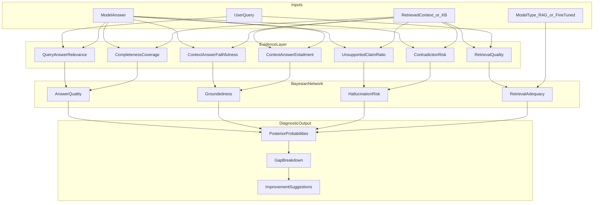

# Bayesian Network RAG/LLM Diagnostic Evaluator

## Assessment of Your Statement

Your core idea is **directionally strong** but the current description is too vague to implement as-is. A few tweaks will make it buildable, explainable, and useful.

### What works well
- Using a **Bayesian Network (BN)** to combine multiple weak signals (retrieval quality, faithfulness, relevance) into a coherent judgment with uncertainty
- **Comparing model output against built-in context / knowledge base** as the grounding anchor
- A **diagnostic goal** (find gaps + suggest improvements) fits BNs well because you can trace *which evidence nodes* drove a low posterior

### What should be tweaked

| Current idea | Recommended tweak |
|---|---|
| BN outputs "0 or 1" | Output **calibrated probabilities** (e.g., `P(faithful)=0.82`, `P(hallucination)=0.19`) plus optional thresholded pass/fail |
| BN "analyzes the query" alone | Split into **Evidence Layer** (measurable scores) + **BN Fusion Layer** (probabilistic reasoning) |
| Single final check | Evaluate **multiple dimensions**: relevance, faithfulness, completeness, contradiction, retrieval quality |
| Implicit comparison with KB | Make KB comparison explicit via **NLI/entailment**, **entity overlap**, and **semantic similarity** nodes |
| Black-box evaluation | Add **gap attribution**: which nodes failed and **actionable fix templates** |

**Recommendation on output format:** Use **probabilistic scores + ranked gap report + improvement suggestions**. Binary 0/1 loses the main benefit of BNs (uncertainty). You can still expose a pass/fail flag via a configurable threshold.

---

## Proposed Architecture



---

## BN Structure (Initial v1)

**Evidence nodes** (observed at runtime, discretized into `{low, medium, high}`):
- `query_relevance` — answer addresses the query
- `context_faithfulness` — answer supported by retrieved/KB context
- `entailment_score` — NLI model: context entails answer
- `retrieval_quality` — query–context similarity (RAG only; for fine-tuned, compare against KB snippets)
- `completeness` — key query facets covered in answer
- `contradiction` — answer contradicts KB/context
- `unsupported_claims` — fraction of atomic claims not supported

**Latent/outcome nodes** (inferred):
- `groundedness` — is the answer KB-grounded?
- `hallucination_risk` — likelihood of fabricated content
- `answer_quality` — overall usefulness
- `retrieval_adequacy` — was context sufficient? (RAG-specific path)

**CPT initialization strategy (greenfield):**
1. **Phase 1:** Expert-defined CPTs (simple rules, e.g., `high faithfulness + low contradiction → high groundedness`)
2. **Phase 2:** Refine CPTs from labeled eval data using **Bayesian parameter learning** (pgmpy `BayesianEstimator`)
3. Keep discretization coarse (3 bins) to avoid data hunger

---

## Gap Analysis and Improvement Mapping

After posterior inference, identify nodes with lowest contributing evidence:

| Failed signal | Likely gap | Suggested fix |
|---|---|---|
| Low `retrieval_quality` | Wrong/missing chunks | Improve embeddings, chunk size, hybrid search, reranker |
| Low `context_faithfulness` but high retrieval | Generation ignoring context | Stronger grounding prompt, cite-before-answer, lower temperature |
| High `unsupported_claims` | Hallucination | Add citation enforcement, RAG-only mode, fine-tune on grounded data |
| Low `completeness` | Partial answer | Increase context window, multi-hop retrieval, decompose query |
| High `contradiction` | Conflicting KB vs model | KB refresh, conflict detection, answer abstention |
| Fine-tuned path, low KB alignment | Stale/parametric knowledge | Route factual queries to RAG, refresh fine-tune data |

Output example:

```json
{
  "model_type": "rag",
  "scores": {
    "answer_quality": 0.61,
    "groundedness": 0.48,
    "hallucination_risk": 0.37,
    "retrieval_adequacy": 0.55
  },
  "gaps": [
    {"dimension": "groundedness", "severity": "high", "driver": "unsupported_claims=high"},
    {"dimension": "retrieval_adequacy", "severity": "medium", "driver": "retrieval_quality=low"}
  ],
  "suggestions": [
    "Add a reranker and increase top-k retrieval — retrieved context poorly matched the query.",
    "Enforce claim-level citation to KB chunks — 3 of 5 claims were unsupported."
  ],
  "verdict": "needs_improvement"
}
```

---

## Recommended Tech Stack (from scratch)

- **Language:** Python 3.11+
- **BN engine:** [`pgmpy`](https://pgmpy.org/) (structure + inference + parameter learning)
- **Embeddings/similarity:** `sentence-transformers` (e.g., `all-MiniLM-L6-v2`)
- **NLI/entailment:** `cross-encoder/nli-deberta-v3-small` or similar
- **Claim decomposition (optional v2):** lightweight LLM or rule-based sentence splitting
- **API:** FastAPI
- **Config:** YAML for BN structure, thresholds, suggestion templates
- **Tests:** pytest with synthetic fixtures

---

## Project Layout

```
e:\Baysian Optimization\
├── README.md
├── pyproject.toml
├── config/
│   ├── bn_structure.yaml      # nodes, edges, CPT templates
│   └── thresholds.yaml        # pass/fail cutoffs, bin edges
├── src/
│   ├── models/                # Pydantic I/O schemas
│   ├── evidence/              # relevance, faithfulness, NLI, retrieval scorers
│   ├── bn/                    # network build, discretize, infer, CPT learning
│   ├── diagnostics/           # gap attribution + suggestion engine
│   └── api/                   # FastAPI endpoints
├── data/
│   └── examples/              # sample eval cases (query, context, answer, labels)
└── tests/
```

---

## API Surface (v1)

- `POST /evaluate` — main endpoint
  - Body: `{ query, answer, context_chunks[], model_type: "rag"|"fine_tuned", kb_chunks[]? }`
  - Returns: posterior scores, gaps, suggestions
- `POST /evaluate/batch` — batch eval for benchmarking
- `GET /health`

---

## Implementation Phases

### Phase 1 — Evidence + Rules (MVP, ~1 week)
- Build evidence scorers (similarity, NLI, basic completeness heuristic)
- Expert CPTs + variable elimination inference
- Gap report + template-based suggestions
- CLI + FastAPI

### Phase 2 — Calibration and Learning
- Collect 50–200 labeled eval cases
- Learn CPT parameters from data
- Tune discretization bins and thresholds

### Phase 3 — Richer Diagnostics
- Atomic claim extraction and per-claim support checking
- Compare RAG vs fine-tuned on same query (optional dual-input mode)
- Export eval reports (JSON/CSV)

---

## Key Risks and Mitigations

- **Cold-start CPTs may be inaccurate** → start with conservative expert rules; treat scores as relative ranking until calibrated
- **NLI/similarity ≠ truth** → treat them as noisy evidence nodes; BN handles uncertainty better than a single metric
- **Fine-tuned models lack explicit context** → always compare against KB snippets retrieved for the query (same retrieval step as RAG path)
- **Over-engineering** → ship Phase 1 before adding LLM-as-judge or complex claim parsing

---

## What We Are NOT Building (v1 scope)

- Answer generation or routing between RAG/fine-tuned
- Fine-tuning pipeline itself
- Full knowledge base ingestion (accept context/KB chunks as input)
- Production-grade labeled dataset (provide format + seed examples only)
